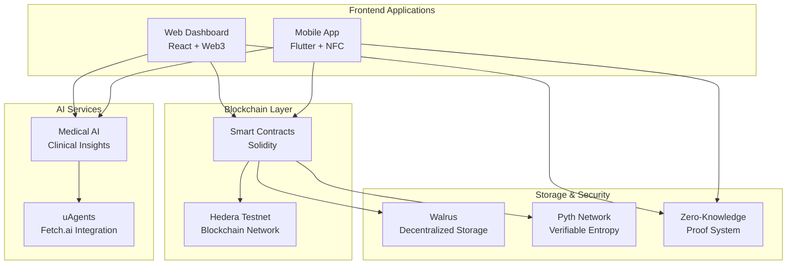
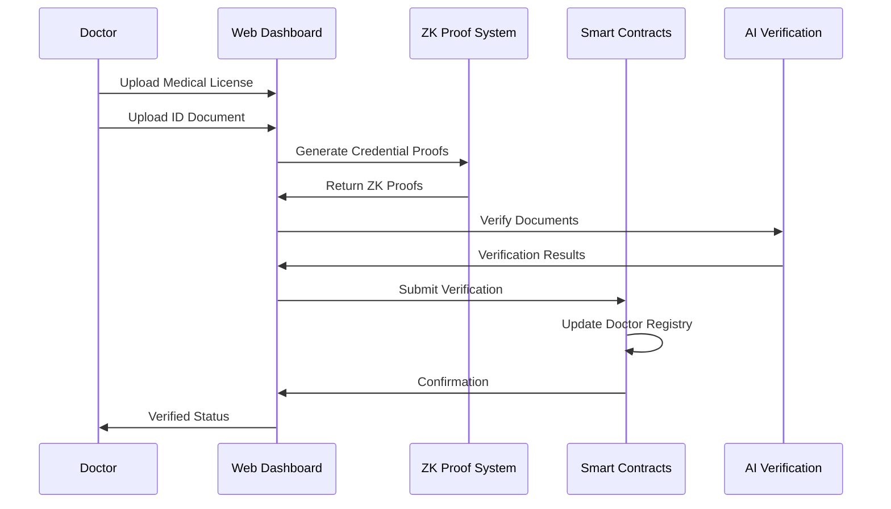
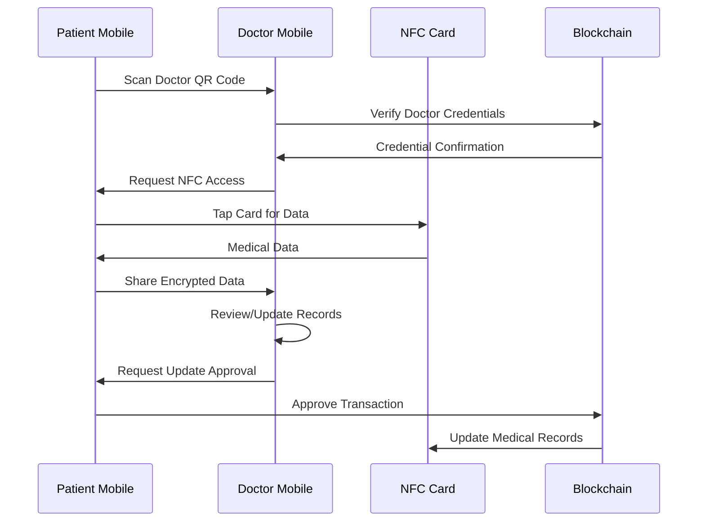

# MediRush: Decentralized Healthcare Platform

## 🏥 Overview

MediRush is a comprehensive Web3 healthcare platform that revolutionizes medical data management through blockchain technology, zero-knowledge proofs, and AI-powered insights. The platform consists of three integrated components: smart contracts, mobile application, and web dashboard, providing a complete ecosystem for secure, patient-sovereign healthcare data management.

## 🌟 Key Features

### 🔒 Privacy & Security
- **Zero-Knowledge Proofs** - Verify credentials without exposing sensitive data
- **NFC Secure Elements** - Hardware-based medical data storage
- **Dynamic Encryption** - Pyth-powered single-use access keys
- **Patient-Sovereign Data** - Complete user control over medical records

### 🏗️ Decentralized Infrastructure
- **Blockchain Integration** - Hedera testnet for immutable transactions
- **Smart Contract Automation** - Trustless medical record management
- **Walrus Storage** - Decentralized, censorship-resistant data storage
- **Web3 Authentication** - Wallet-based identity verification

### 🤖 AI-Powered Healthcare
- **Clinical Decision Support** - AI-assisted medical insights
- **Drug Interaction Analysis** - Automated medication safety checks
- **Diagnostic Recommendations** - Evidence-based test suggestions
- **Medical Data Analysis** - Intelligent health pattern recognition

### 📱 Multi-Platform Access
- **Mobile NFC Integration** - Secure card-based data transfer
- **Web Dashboard** - Comprehensive provider and patient interfaces
- **Cross-Platform Sync** - Seamless data synchronization across devices

## 🏗️ Architecture Overview



## 📱 Platform Components

### 1. Smart Contracts (`/contracts`)

**Core Infrastructure for Decentralized Healthcare**

#### Key Contracts:
- **`Patients.sol`** - Patient registration and authentication
- **`DoctorDetails.sol`** - Doctor verification and reputation management
- **`PatientDetails.sol`** - Medical record storage with blob references
- **`RandomNumber.sol`** - Pyth entropy integration for security

#### Features:
- Reputation-based doctor scoring with slash mechanisms
- Patient-controlled data access permissions
- Tamper-proof medical record versioning
- Dynamic encryption key generation

#### Tech Stack:
- Solidity ^0.8.13
- OpenZeppelin security libraries
- Foundry development framework
- Hedera testnet deployment

### 2. Mobile Application (`/app_frontend`)

**Secure NFC-Enabled Healthcare Companion**

#### User Roles:
**For Patients:**
- NFC medical card management
- Doctor credential verification via QR codes
- Real-time blockchain transaction monitoring
- Secure medical history access

**For Doctors:**
- Medical license verification with ZK proofs
- Patient data access via NFC cards
- QR code generation for patient linking
- Secure record updates

#### Tech Stack:
- Flutter cross-platform framework
- NFC hardware integration
- Hedera blockchain connectivity
- Zero-knowledge proof generation

### 3. Web Dashboard (`/website_frontend`)

**Comprehensive Healthcare Management Interface**

#### Provider Features:
- AI-powered clinical decision support
- Patient information dashboards
- Medical record update workflows
- Doctor credential verification

#### Patient Features:
- Comprehensive medical history tracking
- Healthcare provider search and verification
- Appointment and interaction management
- Secure profile management

#### Tech Stack:
- React 18 with modern hooks
- Wagmi for Web3 integration
- MetaMask wallet connection
- AI-powered medical insights

## 🚀 Quick Start Guide

### Prerequisites
- Node.js (>=16.0.0)
- Flutter SDK (>=3.0.0)
- Foundry (for smart contracts)
- MetaMask wallet
- Android/iOS device with NFC (for mobile)

### 1. Smart Contracts Setup

```bash
# Clone and setup contracts
git clone <repository-url>
cd contracts

# Install dependencies
forge install

# Compile contracts
forge build

# Deploy to Hedera testnet
forge script script/Deploy.s.sol --rpc-url <hedera-testnet-rpc> --private-key <private-key> --broadcast

# Verify contracts
forge verify-contract <contract-address> <contract-name> --chain-id <chain-id>
```

### 2. Web Dashboard Setup

```bash
# Setup web frontend
cd website_frontend

# Install dependencies
npm install

# Configure environment
cp .env.example .env
# Edit .env with your configuration

# Start development server
npm run dev

# Build for production
npm run build
```

### 3. Mobile App Setup

```bash
# Setup mobile app
cd app_frontend

# Install Flutter dependencies
flutter pub get

# Configure platform permissions
# Android: Update AndroidManifest.xml for NFC
# iOS: Update Info.plist for NFC usage

# Run on device
flutter run

# Build APK/IPA
flutter build apk --release
flutter build ios --release
```

## 🔧 Configuration

### Environment Variables

#### Smart Contracts (`contracts/.env`)
```env
PRIVATE_KEY=your_deployment_private_key
HEDERA_RPC_URL=https://testnet.hashio.io/api
ETHERSCAN_API_KEY=your_verification_key
```

#### Web Dashboard (`website_frontend/.env`)
```env
VITE_HEDERA_NETWORK=testnet
VITE_WAGMI_PROJECT_ID=your_wagmi_project_id
VITE_API_BASE_URL=https://api.medirush.io
VITE_AI_SERVICE_URL=https://ai.medirush.io
VITE_CONTRACT_ADDRESSES={"patients":"0x...","doctors":"0x..."}
```

#### Mobile App (`app_frontend/lib/config/env.dart`)
```dart
class Environment {
  static const String hederaNetwork = 'testnet';
  static const String contractAddress = '0x...';
  static const String backendUrl = 'https://api.medirush.io';
  static const String aiServiceUrl = 'https://ai.medirush.io';
}
```

## 🔐 Security Architecture

### Zero-Knowledge Proof System
```
Doctor Credentials → ZK Circuit → Proof Generation → Blockchain Verification
   ↓                    ↓              ↓                    ↓
Medical License    Mathematical    Privacy-Preserved    On-Chain Trust
ID Document        Proof           Verification         Score Update
```

### NFC Security Flow
```
Patient NFC Card → Secure Element → Encrypted Data → Blockchain Update
      ↓               ↓                ↓                 ↓
Medical Data    Hardware Security   AES Encryption   Immutable Record
Storage         Challenge/Response   Dynamic Keys     Version Control
```

### Data Sovereignty Model
```
Patient Controls → Access Permissions → Doctor Requests → Approved Access
      ↓                 ↓                    ↓              ↓
Private Keys    Granular Controls    ZK Verification   Audit Trail
Wallet Auth     Time-Limited         Proof Required    Blockchain Log
```

## 🤖 AI Integration

### Medical AI Agents (Fetch.ai uAgents)

#### Agent Types:
- **Document Verification Agent** - Medical license validation
- **PDF Processing Agent** - Medical document analysis
- **Medical Assistant Agent** - Clinical decision support
- **Reputation Scoring Agent** - Doctor review analysis

#### Integration Points:
```python
# Example: Medical document verification
@agent.on_query(model=VerRequest, replies={VerResponse})
async def verify_medical_license(ctx: Context, sender: str, req: VerRequest):
    # Process medical license PDF
    # Verify with medical council databases
    # Return verification result with confidence score
    pass
```

### Clinical Decision Support
- **Symptom Analysis** - AI-powered diagnostic suggestions
- **Drug Interaction Checking** - Medication safety analysis
- **Treatment Recommendations** - Evidence-based therapy options
- **Risk Assessment** - Patient health risk scoring

## 📊 Platform Workflows

### Doctor Onboarding Flow


### Patient-Doctor Interaction Flow


## 🧪 Testing

### Smart Contracts
```bash
cd contracts
forge test
forge coverage
forge test --gas-report
```

### Web Dashboard
```bash
cd website_frontend
npm run test
npm run test:components
npm run test:integration
npm run test:e2e
```

### Mobile App
```bash
cd app_frontend
flutter test
flutter test integration_test/
flutter drive --target=test_driver/app.dart
```

### End-to-End Platform Testing
```bash
# Start all services
docker-compose up

# Run platform integration tests
npm run test:platform

# Test cross-component workflows
npm run test:workflows
```

## 📈 Performance Metrics

### Blockchain Performance
- **Transaction Speed** - 3-5 seconds on Hedera
- **Gas Costs** - ~$0.0001 per transaction
- **Throughput** - 10,000+ TPS capacity

### Application Performance
- **Web Dashboard** - <2s initial load
- **Mobile App** - <1s NFC read/write
- **ZK Proof Generation** - <5s for credentials

### Security Metrics
- **Encryption Standard** - AES-256 with dynamic keys
- **Proof Verification** - Sub-second ZK validation
- **NFC Security** - Hardware secure element integration

## 🚀 Deployment Guide

### Production Deployment

#### 1. Smart Contracts (Mainnet)
```bash
# Deploy to Hedera Mainnet
forge script script/Deploy.s.sol --rpc-url https://mainnet.hashio.io/api --private-key $PRIVATE_KEY --broadcast --verify

# Update contract addresses in all applications
```

#### 2. Web Dashboard (Vercel/Netlify)
```bash
# Build and deploy
npm run build
vercel --prod

# Configure environment variables in deployment platform
```

#### 3. Mobile App (App Stores)
```bash
# Android Play Store
flutter build appbundle --release
# Upload to Play Console

# iOS App Store
flutter build ios --release
# Archive in Xcode and upload to App Store Connect
```

#### 4. Backend Services (AWS/GCP)
```bash
# Deploy AI agents and APIs
docker build -t medirush-backend .
docker push medirush/backend:latest

# Deploy to cloud provider
kubectl apply -f k8s/
```

### Infrastructure Requirements
- **Cloud Provider** - AWS/GCP/Azure for backend services
- **CDN** - CloudFlare for web application delivery
- **Database** - PostgreSQL for application data
- **Cache** - Redis for session management
- **Monitoring** - DataDog/New Relic for observability

## 🤝 Contributing

### Development Workflow
1. Fork the repository
2. Create a feature branch (`git checkout -b feature/amazing-feature`)
3. Make your changes across relevant components
4. Write tests for new functionality
5. Update documentation
6. Submit a comprehensive pull request

### Code Standards
- **Smart Contracts** - Follow Solidity style guide
- **Web Frontend** - ESLint + Prettier configuration
- **Mobile App** - Dart/Flutter official style guide
- **Documentation** - Clear README updates for changes

### Testing Requirements
- Unit tests for all new functions
- Integration tests for cross-component features
- End-to-end tests for complete user workflows
- Security audits for smart contract changes

## 📄 License

This project is licensed under the MIT License - see the [LICENSE](LICENSE) file for details.

## 🔗 Links & Resources

### Live Applications
- **Web Dashboard** - [app.medirush.io](https://app.medirush.io)
- **Mobile App** - Available on iOS App Store and Google Play Store
- **Smart Contracts** - [Hedera Explorer](https://hashscan.io/testnet)

### Documentation & Support
- **Technical Documentation** - [docs.medirush.io](https://docs.medirush.io)
- **API Reference** - [docs.medirush.io/api](https://docs.medirush.io/api)
- **Developer Portal** - [developers.medirush.io](https://developers.medirush.io)

### Community
- **Discord** - Join our developer community
- **GitHub Issues** - Report bugs and request features
- **Twitter** - [@MediRushDev](https://twitter.com/MediRushDev)
- **Telegram** - [MediRush Developers](https://t.me/medirush_dev)

### Contact
- **Technical Support** - tech@medirush.io
- **Business Inquiries** - business@medirush.io
- **Security Reports** - security@medirush.io

## 🎯 Roadmap

### Phase 1: Foundation (Current)
- ✅ Core smart contracts deployment
- ✅ Web dashboard MVP
- ✅ Mobile app with NFC integration
- ✅ ZK proof system implementation

### Phase 2: Enhanced Features (Q2 2024)
- 🔄 Advanced AI medical insights
- 🔄 Multi-chain support (Ethereum, Polygon)
- 🔄 Enhanced mobile UI/UX
- 🔄 Telemedicine integration

### Phase 3: Scale & Adoption (Q3-Q4 2024)
- 📅 Healthcare provider partnerships
- 📅 Insurance integration APIs
- 📅 Advanced analytics dashboard
- 📅 Global regulatory compliance

### Phase 4: Enterprise (2025)
- 📅 Hospital EHR integration
- 📅 Government health systems
- 📅 Global expansion
- 📅 Advanced AI diagnostic tools

---

**MediRush** - Transforming healthcare through decentralized technology, one patient record at a time. 🏥✨
